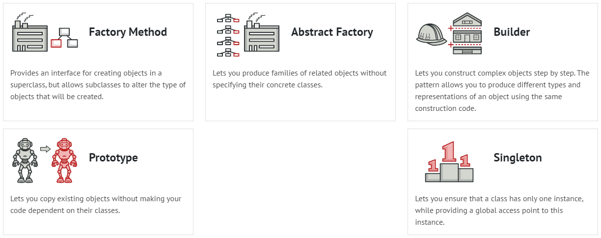
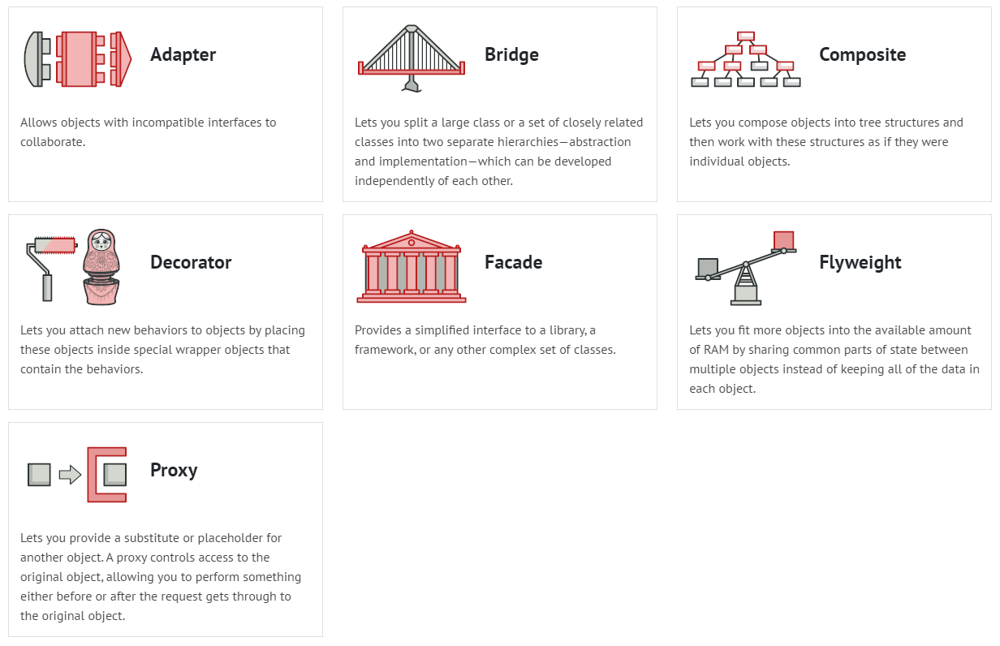
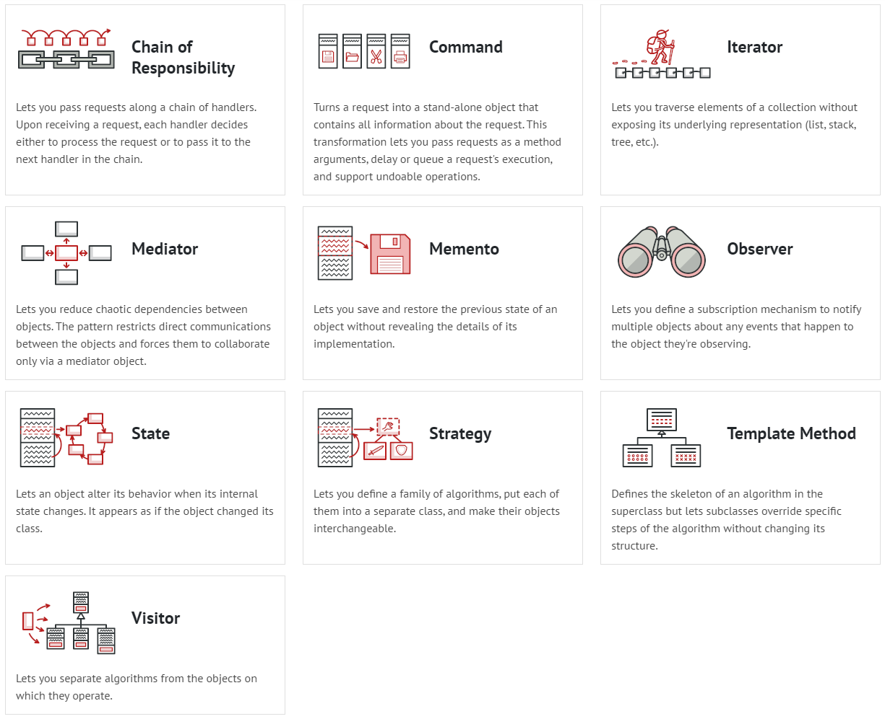

# Design-Patterns
* The 'src' folder contains all examples (C++) and details regarding the usage of the design patterns.
* The 'uml' folder contains all UML diagrams of the examples.
<!-- ABOUT THE PROJECT -->
## Top used patterns
* Creational patterns: Factory method, Singleton, Prototype  
* Structural Patterns: Decorator, Proxy  
* Behavioral Patterns: Observer, Iterator  
## Images of patterns
The images are screeshoted from 
* [refactoring.guru](https://refactoring.guru/design-patterns)
* Creational patterns: 

* Structural Patterns: 

* Behavioral Patterns: 

